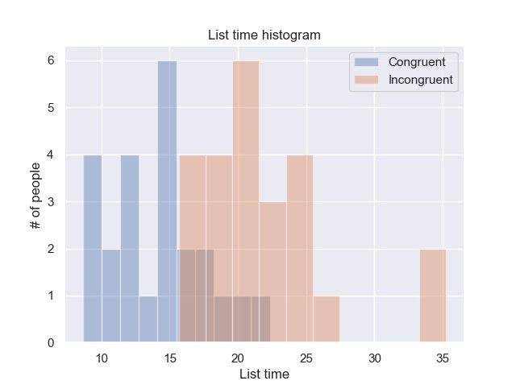
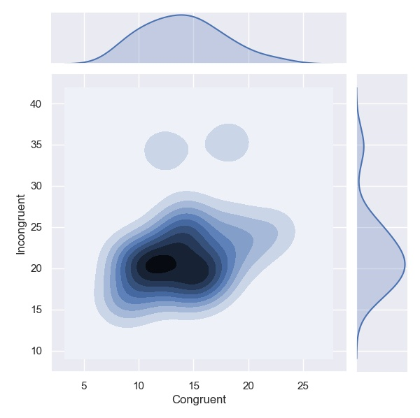
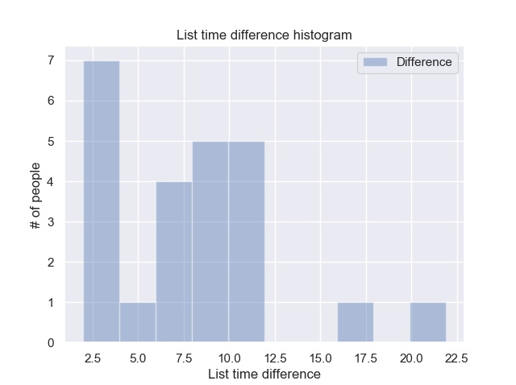

# Statistics: The Science of Decisions Project Instructions
## Background Information
In a Stroop task, participants are presented with a list of words, with each word displayed in a color of ink. The participant’s task is to say out loud the color of the ink in which the word is printed. The task has two conditions: a congruent words condition, and an incongruent words condition. In the congruent words condition, the words being displayed are color words whose names match the colors in which they are printed: for example RED, BLUE. In the incongruent words condition, the words displayed are color words whose names do not match the colors in which they are printed: for example PURPLE, ORANGE. In each case, we measure the time it takes to name the ink colors in equally-sized lists. Each participant will go through and record a time from each condition.

## Questions For Investigation
As a general note, be sure to keep a record of any resources that you use or refer to in the creation of your project. You will need to report your sources as part of the project submission.

1. What is our independent variable? What is our dependent variable?
   
   Dependent variable: the time it takes to name the ink colors in a list of color words.
   Independent variable: Whether or not the ink color matches the color written. That is, if the words are congruent with the ink colors or not. 

2. What is an appropriate set of hypotheses for this task? What kind of statistical test do you expect to perform? Justify your choices.
   
   Hypothesis:
   - Null hypothesis: the fact that the words of the list are congruent or not does not affect the time it takes to name the ink colors in the list. More precisely, that the mean of both times is the same, or in other words, that the mean of the difference of the times is zero.
   $$\mu_d =\mu_i-\mu_c = 0$$
   - Alternative hypothesis: the fact that the words of the list are congruent or not affects the time it takes to name the ink colors in the list. More precisely, that the mean of both times is not the same, or in other words, that the mean of the difference of the times is not zero.
   $$\mu_d =\mu_i-\mu_c \neq 0$$
    
    Statistical tests:
    We have a repeated measures design and we are going to perform a dependent t-test for paired samples. The reason is that the same sample of people are performing both tasks of reading the lists of incongruent and congruent color words (two conditions). The reason to use t-test instead of Z-test is that we cannot assume to have a normal sampling distribution when we apply the central limit theorem since the low number of samples is too low (24), being 30 the minimum number to have a good estimation of the standard deviation of the time distribution, which it is estimated using the bessel's correction $s^2 = \frac {1}{n-1} \sum_{i=1}^n  \left(x_i - \overline{x} \right)^ 2$ 

Now it’s your chance to try out the Stroop task for yourself. Go to this link, which has a Java-based applet for performing the Stroop task. Record the times that you received on the task (you do not need to submit your times to the site.) Now, download this dataset which contains results from a number of participants in the task. Each row of the dataset contains the performance for one participant, with the first number their results on the congruent task and the second number their performance on the incongruent task.

1. Report some descriptive statistics regarding this dataset. Include at least one measure of central tendency and at least one measure of variability.
   As measure of central tendency we choose the mean $\mu$ as: 
   $$\mu = \frac {1}{n} \sum_{i=1}^n x_i$$

   With the following results:
      $$\mu_c =14.051125$$
      $$\mu_i =22.015917$$
      $$\mu_d =7.964792$$

   
   As measure of variability we choose the standard deviation $s$ as:
   $$s^2 = \frac {1}{n} \sum_{i=1}^n  \left(x_i - \mu \right)^ 2$$

   With the following results:
      $$s_c =3.559358$$
      $$s_i =4.797057$$
      $$s_d =4.864827$$


2. Provide one or two visualizations that show the distribution of the sample data. Write one or two sentences noting what you observe about the plot or plots.
   ``` python
   import pandas as pd 
   import matplotlib.pyplot as plt
   import seaborn as sns

   data = pd.read_csv("./stroopdata.csv")

   sns.set(color_codes=True)
   sns.distplot(data["Congruent"], bins=10, kde=False, label="Congruent")
   sns.distplot(data["Incongruent"], bins=10, kde=False, label="Incongruent")
   plt.xlabel("List time", fontdict=None, labelpad=None)
   plt.ylabel("# of people", fontdict=None, labelpad=None)
   plt.legend(loc='upper right')
   plt.title("List time histogram", fontdict=None, loc='center', pad=None)
   plt.show()

   ```

   Output image:
   

      In this visualization we can observe the histogram for both conditions.
      We can observe two things:
      1. The incongruent condition has larger values of time compared to the congruent condition.
      2. The incongruent seems to have 2 outliers with values of 35


   ``` python
   sns.jointplot(x="Congruent", y="Incongruent", data=data, kind="kde")
   plt.show()

   ```
   Output image:
   

   In this visualization we can observe a kernel scatter plot for both conditions.
   We can observe two things:

      1. Again, that the incongruent condition has larger values of time compared to the congruent condition.
      2. The graph is not disperse, which shows that both conditions are paired, which makes sense since both conditions are measured for the same people.

   ``` python
   sns.distplot(data["Difference"], bins=10, kde=False, label="Difference")
   plt.xlabel("List time difference", fontdict=None, labelpad=None)
   plt.ylabel("# of people", fontdict=None, labelpad=None)
   plt.legend(loc='upper right')
   plt.title("List time difference histogram", fontdict=None, loc='center', pad=None)
   plt.show()

   ```
   Output image:
   

   In this visualization we can observe the histogram for the difference between both conditions.
   We can observe two things:

      1. The difference is always positive
      2. The dispersion is similar to the congruent and incongruent conditions


Now, perform the statistical test and report your results. What is your confidence level and your critical statistic value? Do you reject the null hypothesis or fail to reject it? Come to a conclusion in terms of the experiment task. Did the results match up with your expectations?

   We are going to compute the t-statistic for dependent variables as:
   $$t = \frac {\mu_d - 0}{\frac {s_d}{\sqrt n}}$$

   We are using directly the difference between both conditions

   With the following result:
   $$t = \frac {7.9648 - 0}{\frac {4.8648}{\sqrt 24}}= 8.0207$$

   Checking the t-table, we see that the t-critical values for 23 degrees of freedom and right tail $\alpha= 0.0005$ is 3.768. 

   Therefore we can state that:
      1. There is a probability less than 0.001 that both condition's probability distribution have different means
      2. There is a probability less than 0.0005 that the incongruent condition probability distribution mean is lower than or equal than the congruent one.

   Therefore, we can reject the null hypothesis.

   This was expected as reading a color which ink color does not corresponds to the world is dissonant and should perturb somehow our brain. 

Optional: What do you think is responsible for the effects observed? Can you think of an alternative or similar task that would result in a similar effect? Some research about the problem will be helpful for thinking about these two questions!

   After reading the different theories about the reasons behind I would incline for the automaticity one. It states that reading is an automatic process whereas recognizing colors is not, therefore you must invest attention to suppress it, which is drag from recognizing the ink color. 

   In order to choose a theory I have made some testing myself. I noticed that the effect actually works for me, and also that I can improve the time, specially for long lists. As soon as I am able to overcome the reading reflex for the first colors, I can do it fast if I keep the focus. Therefore it seems to me that it is a matter of suppressing an automatic reflex. Moreover, when I say the colors in a different language that the words are written, this improves the time. 

   A similar task could be done with any two conflicting stimulus. For example making making simple mental number calculations with the following conditions: 1) visualizing at the same time other numbers with the same order of magnitude, 2) visualizing a random image. Visualizing other numbers will trigger its reading and thus interfere with the calculation. Example: compute 33+62 will visualizing 87.